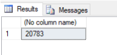
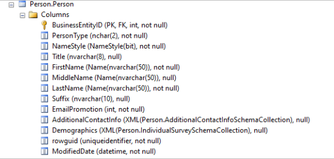
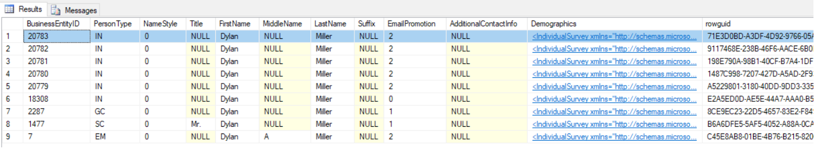
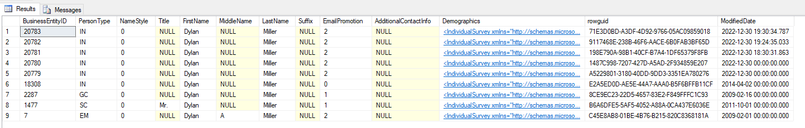
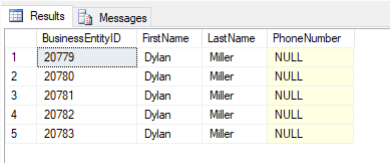

# Przetestowanie ogólnodostępnej bazy danych AdventureWorks2014

### 1. Dodawanie nowego użytkownika do tabeli Person.Person:

Przed dodaniem wpisu do tabeli Person.Person należy najpierw dodać wpis do tabeli Person.BusinessEntity, która zawiera PrimaryKey (PK) na kolumnie: BusinessEntityID.

Tabela Person.Person ma ustawioną kolumnę BusinessEntityID jako PrimaryKey (PK) i ForeignKey(FK), dlatego powyższe jest wymagane.
 
Struktura tabeli Person.BusinessEntity (fragment):

```sql
CREATE TABLE Person.BusinessEntity(
	[BusinessEntityID] [int] IDENTITY(1,1) NOT FOR REPLICATION NOT NULL,
	[rowguid] [uniqueidentifier] ROWGUIDCOL  NOT NULL CONSTRAINT [DF_BusinessEntity_rowguid]  DEFAULT (newid()),
	[ModifiedDate] [datetime] NOT NULL CONSTRAINT [DF_BusinessEntity_ModifiedDate]  DEFAULT (getdate()),
 CONSTRAINT [PK_BusinessEntity_BusinessEntityID] PRIMARY KEY CLUSTERED
```

Dodaję wpis do tabeli Person.BusinessEntity:

```sql
INSERT INTO Person.BusinessEntity 
DEFAULT VALUES
```
### 2. Następnie sprawdzam, jaki ID został nadany w powyższym kroku:

```sql
SELECT MAX(BUSINESSENTITYID)  
FROM  Person.BusinessEntity
```



### 3. Teraz mogę dodać nowego użytkownika, podając najnowszy BusinessEntityID i pozostałe wymanage wartości (kolumny, które w opisie mają `not null`):



```sql
INSERT INTO Person.Person (BusinessEntityID ,PersonType, NameStyle, FirstName, LastName, EmailPromotion, ModifiedDate) 
VALUES ( 20783,'IN', 0, 'Dylan', 'Miller', 2,  GETUTCDATE())
```

Powyższe polecenie wykonałam kilka razy, najpierw generując kolejne BusinessEntityID:



### 4. Sprawdzam, czy użytkownik został dodany do wybranej tabeli (wiele wpisów dla tego samego imienia i nazwiska):

```sql
SELECT *
FROM Person.Person
WHERE LastName = 'Miller'
AND FirstName = 'Dylan'
ORDER BY BusinessEntityID DESC
```



### 5. Wiedząc, że istnieje tabela Person.PersonPhone, sprawdzam, czy dodani przeze mnie użytkownicy (lub istniejący wcześniej) nie mają przypisanego nr telefonu (nie zdefiniowałam dla nich nr telefonu przy dodawaniu):

```sql
SELECT Person.Person.BusinessEntityID, FirstName, LastName, PhoneNumber
FROM Person.Person
LEFT JOIN Person.PersonPhone
ON Person.BusinessEntityID = PersonPhone.BusinessEntityID
WHERE Person.PersonPhone.PhoneNumber IS NULL
```


